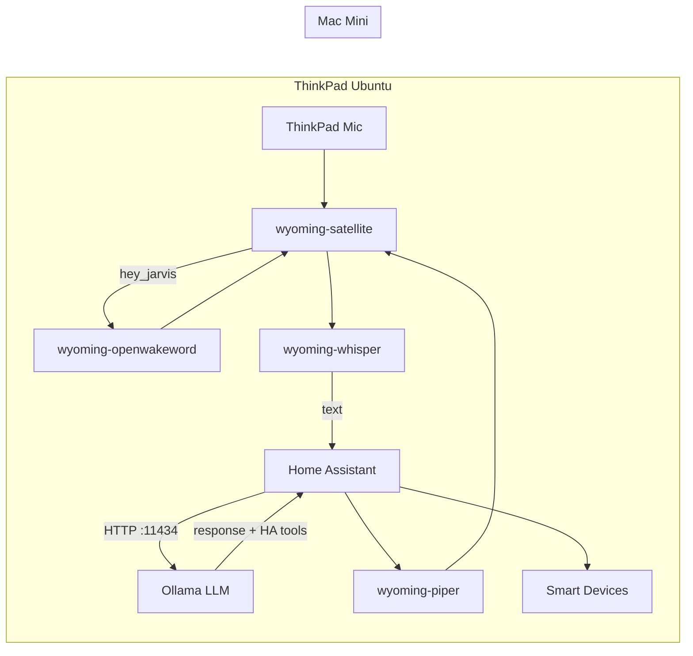

# Smart Home Assistant (Ubuntu)

Fully local smart home voice assistant running on Ubuntu (ThinkPad). Home Assistant orchestrates smart devices; Wyoming services handle wake word, speech-to-text, and text-to-speech on the ThinkPad; a Mac Mini runs Ollama for natural-language understanding and device control.

## Architecture



**Voice flow**

1. `wyoming-satellite` listens on the ThinkPad microphone 24/7.
2. `wyoming-openwakeword` detects the wake word `hey_jarvis`.
3. `wyoming-whisper` transcribes speech (Japanese/English auto-detection).
4. Home Assistant Assist sends the text to Ollama on the Mac Mini.
5. Ollama (with **Control Home Assistant** enabled) operates exposed entities.
6. `wyoming-piper` speaks the response in Japanese.

## Prerequisites

### ThinkPad (Ubuntu)

- Ubuntu with Docker and Docker Compose
- Built-in or USB microphone and speakers
- `alsa-utils` for audio device detection: `sudo apt install alsa-utils`
- LAN access to the Mac Mini

### Mac Mini

- [Ollama](https://ollama.com/download) installed
- Ollama listening on the LAN (not only localhost):

  ```bash
  # macOS: set in ~/.zshrc or launchd, then restart Ollama
  export OLLAMA_HOST=0.0.0.0:11434
  ```

- A model pulled, e.g.:

  ```bash
  ollama pull qwen2.5:3b
  # or: ollama pull llama3.2
  ```

- Firewall allows TCP `11434` from the ThinkPad IP

Verify from the ThinkPad:

```bash
curl http://<mac-mini-ip>:11434/api/tags
```

## Quick start

Clone this repository to `~/smarthome` on the ThinkPad:

```bash
git clone git@github.com:seiya0022/smart-home-assistant.git ~/smarthome
cd ~/smarthome
```

Run first-time setup:

```bash
./scripts/setup.sh
```

Edit `.env` with your Mac Mini IP and audio devices:

```bash
./scripts/detect-audio.sh   # find MIC_DEVICE / SND_DEVICE
nano .env
docker compose up -d        # apply .env changes
```

Open Home Assistant: `http://<thinkpad-ip>:8123`

Complete the [Home Assistant UI configuration](#home-assistant-ui-configuration) below.

## Directory layout

```
~/smarthome/
├── docker-compose.yml
├── .env.example
├── scripts/
│   ├── setup.sh
│   └── detect-audio.sh
├── homeassistant/
│   └── config/
│       ├── configuration.yaml
│       ├── automations.yaml
│       ├── scripts.yaml
│       └── secrets.yaml.example
├── whisper/          # Whisper model cache (auto-downloaded)
└── piper/            # Piper voice model cache (auto-downloaded)
```

## Docker services

| Service | Port | Role |
|---------|------|------|
| `homeassistant` | 8123 (host) | Smart home hub, Assist pipeline |
| `wyoming-whisper` | 10300 | Speech-to-text |
| `wyoming-piper` | 10200 | Text-to-speech (Japanese) |
| `wyoming-openwakeword` | 10400 | Wake word (`hey_jarvis`) |
| `wyoming-satellite` | 10700 | Microphone input / speaker output |

Home Assistant uses `network_mode: host` to reach smart devices on the LAN. Wyoming services publish ports on `127.0.0.1` for HA to connect.

> **Note:** `rhasspy/wyoming-satellite` is deprecated in favor of ESPHome-based voice hardware. It remains the practical way to use the ThinkPad built-in mic from Docker. You can migrate to an ESP32-S3 voice satellite later without changing the rest of the stack.

## Home Assistant UI configuration

After the first boot, configure integrations in the HA web UI.

### 1. Wyoming Protocol (×4)

Go to **Settings → Devices & services → Add integration → Wyoming Protocol**.

If services are not auto-discovered, add manually:

| Service | Host | Port |
|---------|------|------|
| Whisper | `127.0.0.1` | `10300` |
| Piper | `127.0.0.1` | `10200` |
| OpenWakeWord | `127.0.0.1` | `10400` |
| Satellite (ThinkPad) | `127.0.0.1` | `10700` |

### 2. Ollama

**Settings → Devices & services → Add integration → Ollama**

- **URL:** `http://<mac-mini-ip>:11434`
- **Model:** e.g. `qwen2.5:3b` (must match a model pulled on the Mac Mini)
- **Control Home Assistant:** enable this option

Expose entities the assistant may control:

**Settings → Voice assistants → Expose → Add entities**

Select lights, switches, climate, etc. Start with a small set and expand as needed.

### 3. Voice assistant

**Settings → Voice assistants → Add assistant**

| Setting | Value |
|---------|-------|
| Wake word | `hey_jarvis` (OpenWakeWord) |
| Speech-to-text | Whisper |
| Conversation agent | Ollama (with Control HA enabled) |
| Text-to-speech | Piper (`ja_JP-htm-medium`) |

Link the assistant to the ThinkPad satellite if prompted.

### 4. Test

Say **"hey_jarvis"**, wait for the listening tone, then speak a command in Japanese or English, e.g.:

- "リビングのライトをつけて"
- "Turn on the living room light"

The assistant should execute the action and respond via Piper TTS.

## Environment variables

Copy `.env.example` to `.env`:

| Variable | Description |
|----------|-------------|
| `TZ` | Timezone (default `Asia/Tokyo`) |
| `MIC_DEVICE` | ALSA device for microphone (`default` or `plughw:...`) |
| `SND_DEVICE` | ALSA device for speaker output |
| `MAC_MINI_IP` | Reference IP for Ollama (configured in HA UI) |
| `OLLAMA_MODEL` | Reference model name (configured in HA UI) |

## Troubleshooting

### Wyoming services not discovered

```bash
docker compose ps
docker compose logs wyoming-whisper
docker compose logs wyoming-piper
docker compose logs wyoming-openwakeword
docker compose logs wyoming-satellite
```

Ensure ports `10200`, `10300`, `10400`, `10700` are listening:

```bash
ss -tlnp | grep -E '10200|10300|10400|10700'
```

Add integrations manually with `127.0.0.1` and the port above.

### Wake word or microphone not working

1. Run `./scripts/detect-audio.sh` and set `MIC_DEVICE` / `SND_DEVICE` in `.env`.
2. Confirm the user is in the `audio` group: `groups` (add with `sudo usermod -aG audio $USER` if needed).
3. Restart the satellite: `docker compose restart wyoming-satellite`.
4. Check logs: `docker compose logs -f wyoming-satellite`.

Test capture on the host (outside Docker):

```bash
arecord -D plughw:CARD=PCH,DEV=0 -d 3 -f S16_LE -r 16000 test.wav
aplay test.wav
```

Replace the device string with your `MIC_DEVICE` value.

### Ollama connection failed

From the ThinkPad:

```bash
curl http://<mac-mini-ip>:11434/api/tags
```

If this fails:

- Confirm `OLLAMA_HOST=0.0.0.0:11434` on the Mac Mini and restart Ollama.
- Check Mac firewall settings.
- Use the Mac Mini LAN IP, not `localhost`, in the HA Ollama integration.

### LLM does not control devices

- Enable **Control Home Assistant** when adding the Ollama integration.
- Expose entities under **Settings → Voice assistants → Expose**.
- Use a model that supports tool/function calling (`qwen2.5:3b`, `llama3.2`, etc.).
- Device control via Ollama is experimental in Home Assistant; keep commands simple at first.

### STT language / TTS voice

- Whisper uses `--language auto` for Japanese and English detection.
- Piper is configured for Japanese only (`ja_JP-htm-medium`). English replies are spoken with the Japanese voice. To add English TTS later, run a second Piper container on another port with an English voice and a second Assist pipeline.

## Operations

```bash
# Start all services
docker compose up -d

# Stop all services
docker compose down

# View logs
docker compose logs -f

# Restart after config change
docker compose up -d --force-recreate
```

Back up `homeassistant/config/` regularly (excluding `.storage` is optional; including it preserves UI integration config).

## Future extensions

- **ESPHome voice satellite:** replace `wyoming-satellite` with dedicated hardware in other rooms.
- **Second Piper instance:** English TTS for bilingual responses.
- **Custom bridge API:** if HA Ollama integration is insufficient, add a small Python service between STT and device actions.

## License

See repository license. Third-party images: [Home Assistant](https://www.home-assistant.io/), [Rhasspy Wyoming](https://github.com/rhasspy/wyoming), [Ollama](https://ollama.com/).
