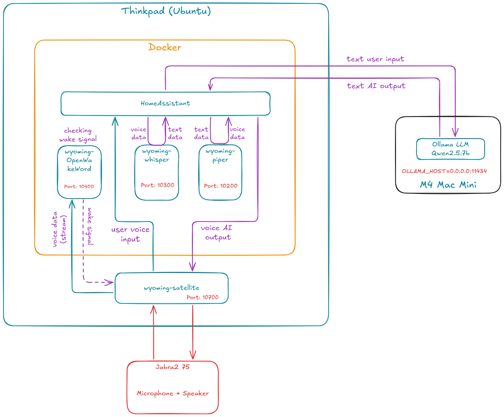

# Smart Home Voice Assistant

## Overview

This project is a **locally hosted voice assistant** for smart home control. It runs on an Ubuntu ThinkPad and uses a Mac Mini on the same LAN for language understanding. Voice processing (wake word, speech-to-text, text-to-speech) stays on the ThinkPad; only the large language model (LLM) request is sent to Ollama on the Mac Mini.

The wake word is **"hey_jarvis"**. After detection, you can speak commands in Japanese or English to control lights, switches, climate, and other exposed devices through Home Assistant.

This setup is designed for **privacy and local control**: no cloud voice service is required, and smart devices are managed on your home network.

## Key features

- **Wake word detection** via OpenWakeWord (`hey_jarvis`)
- **Speech-to-text (STT)** via Whisper with automatic Japanese/English detection
- **Natural-language control** via Ollama and Home Assistant
- **Text-to-speech (TTS)** via Piper (`en_US-amy-medium`)
- **Optional wake chime** when the wake word is detected
- **Background audio ducking** that lowers other apps during a voice session
- **USB audio hot-plug** support through PipeWire/Pulse `pulse` devices

## Architecture

### System diagram



<details>
<summary>Mermaid source (click to expand)</summary>

```text
graph TD
    AudioHW["Microphone + Speaker"]
    Mac["Mac Mini<br>Ollama LLM<br>OLLAMA_HOST=0.0.0.0:11434"]

    subgraph Thinkpad ["ThinkPad (Ubuntu)"]
        Sat["wyoming-satellite<br>Port: 10700"]

        subgraph Docker ["Docker"]
            HA["Home Assistant"]
            Wake["wyoming-openwakeword<br>Port: 10400"]
            Whisp["wyoming-whisper<br>Port: 10300"]
            Piper["wyoming-piper<br>Port: 10200"]
        end
    end

    AudioHW <--> Sat
    Sat -->|"hey_jarvis"| Wake
    Wake --> Sat
    Sat -->|"user voice"| HA
    HA -->|"audio"| Whisp
    Whisp -->|"text"| HA
    HA -->|"text"| Mac
    Mac -->|"response"| HA
    HA -->|"text"| Piper
    Piper -->|"audio"| HA
    HA -->|"TTS audio"| Sat
```
</details>

### Voice flow

1. `wyoming-satellite` (a host systemd service on the ThinkPad) listens on the microphone.
2. `wyoming-openwakeword` (Docker) detects the wake word `hey_jarvis`.
3. `wyoming-whisper` (Docker) transcribes speech with automatic language detection.
4. Home Assistant Assist sends the text to Ollama on the Mac Mini.
5. Ollama (with **Control Home Assistant** enabled) operates exposed entities.
6. `wyoming-piper` (Docker) synthesizes the spoken response in English.
7. `wyoming-satellite` plays the response through the speaker.

### Components

| Component | Host | Port | Role |
|-----------|------|------|------|
| Home Assistant | Docker (host network) | 8123 | Smart home hub and Assist pipeline |
| wyoming-whisper | Docker | 10300 | Speech-to-text |
| wyoming-piper | Docker | 10200 | Text-to-speech (`en_US-amy-medium`) |
| wyoming-openwakeword | Docker | 10400 | Wake word (`hey_jarvis`) |
| wyoming-satellite | Host (systemd) | 10700 | Microphone input and speaker output |
| Ollama | Mac Mini | 11434 | Language model inference |

Home Assistant uses `network_mode: host` to reach smart devices on the LAN. Wyoming services publish ports on `127.0.0.1` for Home Assistant to connect.

> **Note:** `wyoming-satellite` runs on the ThinkPad host (not in Docker) for stable USB audio hot-plug via PipeWire/Pulse `pulse` devices. The upstream [rhasspy/wyoming-satellite](https://github.com/rhasspy/wyoming-satellite) project is deprecated; [Linux Voice Assistant](https://github.com/OHF-Voice/linux-voice-assistant) is the successor. This host install keeps the current Wyoming stack working. You can migrate to ESP32-S3 or LVA later without changing the rest of the stack.

## Prerequisites

### ThinkPad (Ubuntu)

- Ubuntu with Docker and Docker Compose
- Built-in or USB microphone and speakers
- PipeWire/PulseAudio (usually preinstalled on Ubuntu Desktop)
- `alsa-utils` for audio device detection: `sudo apt install alsa-utils`
- LAN access to the Mac Mini

### Mac Mini

- [Ollama](https://ollama.com/download) installed
- Ollama listening on the LAN (not only localhost):

  ```bash
  # macOS: set in ~/.zshrc or launchd, then restart Ollama
  export OLLAMA_HOST=0.0.0.0:11434
  ```

- A model pulled, for example:

  ```bash
  ollama pull qwen2.5:7b
  # or: ollama run llama3.2
  ```

- Firewall allows TCP `11434` from the ThinkPad IP

If UFW is enabled on the ThinkPad, allow outbound access to Ollama on the Mac Mini:

```bash
sudo ufw allow out to <mac-mini-ip> port 11434 proto tcp
```

Verify connectivity from the ThinkPad:

```bash
curl http://<mac-mini-ip>:11434/api/tags
```

## Quick start

1. Clone this repository to `~/smarthome` on the ThinkPad:

   ```bash
   git clone git@github.com:seiya0022/smart-home-assistant.git ~/smarthome
   cd ~/smarthome
   ```

2. Run first-time setup:

   ```bash
   ./scripts/setup.sh
   ```

3. Install the voice satellite on the ThinkPad host (one-time):

   ```bash
   ./scripts/install-wyoming-satellite.sh
   ```

4. Configure environment and audio:

   ```bash
   ./scripts/detect-audio.sh   # confirm MIC_DEVICE / SND_DEVICE (default: pulse)
   nano .env
   ./scripts/restart-wyoming-satellite.sh   # apply .env audio changes
   docker compose up -d        # start Docker services
   ```

5. Open Home Assistant: `http://<thinkpad-ip>:8123`

6. Complete the [Home Assistant UI configuration](#home-assistant-ui-configuration) below.

## Directory layout

```
~/smarthome/
├── docker-compose.yml
├── .env.example
├── scripts/
│   ├── setup.sh
│   ├── install-wyoming-satellite.sh
│   ├── restart-wyoming-satellite.sh
│   ├── wyoming-satellite-logs.sh
│   ├── audio-duck.sh
│   ├── detect-audio.sh
│   └── benchmark-ollama.sh
├── assets/
│   ├── images/
│   │   └── HomeAssistant_Diagram.png
│   └── sounds/
│       └── awake.wav   # optional wake chime
├── homeassistant/
│   └── config/
│       ├── configuration.yaml
│       ├── automations.yaml
│       ├── scripts.yaml
│       └── secrets.yaml.example
├── whisper/          # Whisper model cache (auto-downloaded)
└── piper/            # Piper voice model cache (auto-downloaded)
```

The `wyoming-satellite` application is cloned to `~/wyoming-satellite` and runs as a user systemd service.

## Audio features

### Volume ducking

From wake word detection until the assistant finishes speaking, background audio from other apps (music, video, browser tabs) is lowered. Jarvis TTS output (`aplay`) is **not** ducked.

| Event | Action |
|-------|--------|
| Wake word detected | Other apps lowered to `DUCK_LEVEL` (default `20%`) |
| TTS playback complete | Volume restored |
| Error or timeout (`DUCK_TIMEOUT` seconds) | Volume restored |

Configure in `.env`:

| Variable | Description |
|----------|-------------|
| `AUDIO_DUCK_ENABLED` | `1` to enable, `0` to disable |
| `DUCK_LEVEL` | Target volume for ducked apps (e.g. `20%`) |
| `DUCK_TIMEOUT` | Seconds before auto-restore (default `40`) |

Requires `pulseaudio-utils` (`pactl`; works with PipeWire):

```bash
sudo apt install -y pulseaudio-utils
```

After changing settings, restart the satellite:

```bash
./scripts/install-wyoming-satellite.sh   # first install or service template changes
./scripts/restart-wyoming-satellite.sh   # .env-only changes (DUCK_*, etc.)
```

### Wake chime

A short sound can play when `hey_jarvis` is detected. You provide the audio file.

| Item | Value |
|------|-------|
| Format | **WAV (PCM)** — MP3 is not supported |
| Recommended | 16-bit mono, 22050 Hz, 0.5–2 seconds |
| Location | `assets/sounds/awake.wav` |
| Setting | `AWAKE_WAV=assets/sounds/awake.wav` in `.env` |

If the file is missing, the satellite starts normally without a chime (ducking still works). The chime is played through `aplay`, so it is **not** affected by volume ducking.

```bash
# 1. Place the audio file
cp /path/to/your-chime.wav assets/sounds/awake.wav

# 2. Re-run install to apply --awake-wav to the service
systemctl --user stop wyoming-satellite
./scripts/install-wyoming-satellite.sh
```


## Home Assistant UI configuration

After the first boot, configure integrations in the Home Assistant web UI.

### 1. Wyoming Protocol (×4)

Go to **Settings → Devices & services → Add integration → Wyoming Protocol**.

If services are not auto-discovered, add them manually:

| Service | Host | Port |
|---------|------|------|
| Whisper | `127.0.0.1` | `10300` |
| Piper | `127.0.0.1` | `10200` |
| OpenWakeWord | `127.0.0.1` | `10400` |
| Satellite (ThinkPad) | `127.0.0.1` | `10700` |

### 2. Ollama

**Settings → Devices & services → Add integration → Ollama**

- **URL:** `http://<mac-mini-ip>:11434`
- **Model:** e.g. `qwen2.5:3b` (must match a model pulled on the Mac Mini)
- **Control Home Assistant:** enable this option

Expose entities the assistant may control:

**Settings → Voice assistants → Expose → Add entities**

Select lights, switches, climate, and other devices. Start with a small set and expand as needed.

### 3. Voice assistant

**Settings → Voice assistants → Add assistant**

| Setting | Value |
|---------|-------|
| Wake word | `hey_jarvis` (OpenWakeWord) |
| Speech-to-text | Whisper |
| Conversation agent | Ollama (with Control HA enabled) |
| Text-to-speech | Piper (`en_US-amy-medium`) |

Link the assistant to the ThinkPad satellite if prompted.

### 4. Test

Say **"hey_jarvis"**, wait for the listening tone, then speak a command in English, for example:

- "Play some music"
- "How is the weather today?"

The assistant should execute the action and respond via Piper TTS.

## Environment variables

Copy `.env.example` to `.env`:

| Variable | Description |
|----------|-------------|
| `TZ` | Timezone (default `Asia/Tokyo`) |
| `MIC_DEVICE` | ALSA device for microphone (`pulse` recommended; or `default`, `plughw:...`) |
| `SND_DEVICE` | ALSA device for speaker output (`pulse` recommended) |
| `AUDIO_DUCK_ENABLED` | Enable volume ducking for other apps during Assist (`1` / `0`) |
| `DUCK_LEVEL` | Target volume for ducked apps (e.g. `20%`) |
| `DUCK_TIMEOUT` | Seconds before auto-restoring volume if Assist does not finish |
| `AWAKE_WAV` | Path to wake chime WAV (relative to repo root; omitted if file missing) |
| `MAC_MINI_IP` | Reference IP for Ollama (configured in HA UI) |
| `OLLAMA_MODEL` | Reference model name (configured in HA UI) |

## Operations

```bash
# Start Docker services
docker compose up -d

# Stop Docker services (host satellite keeps running)
docker compose down

# View Docker logs
docker compose logs -f

# Host satellite status / logs / restart
systemctl --user status wyoming-satellite
./scripts/wyoming-satellite-logs.sh
./scripts/restart-wyoming-satellite.sh

# Restart after Docker config change
docker compose up -d --force-recreate
```

Daily startup: run `docker compose up -d` only. The host `wyoming-satellite` service starts automatically at login (or at boot if `loginctl enable-linger` was enabled during install).

Back up `homeassistant/config/` regularly. Excluding `.storage` is optional; including it preserves UI integration settings.

### 24/7 operation (Ubuntu laptop)

To keep the ThinkPad running when the lid is closed:

**Enable (ignore lid switch)**

1. Open the configuration file:

   ```bash
   sudo nano /etc/systemd/logind.conf
   ```

2. Under `[Login]`, set:

   - `HandleLidSwitch=ignore`
   - `HandleLidSwitchExternalPower=ignore`

3. Save and apply:

   ```bash
   sudo systemctl restart systemd-logind
   ```

**Revert (default suspend on lid close)**

1. Open `/etc/systemd/logind.conf` as above.
2. Comment out or set `HandleLidSwitch=suspend` and `HandleLidSwitchExternalPower=suspend`.
3. Run `sudo systemctl restart systemd-logind`.

**Note:** This stack involves many moving parts (host satellite, four Wyoming services, Home Assistant, and remote Ollama). It rarely works perfectly on the first attempt. When something fails, start with the commands above — Docker logs, `systemctl --user status wyoming-satellite`, and `./scripts/wyoming-satellite-logs.sh` — and verify prerequisites (audio devices, UFW, Mac Mini Ollama reachability via `curl`). For Ollama latency checks over LAN, run `./scripts/benchmark-ollama.sh`.

## Future extensions

- **ESPHome voice satellite** or **Linux Voice Assistant:** replace host `wyoming-satellite` with dedicated hardware or the LVA successor stack.
- **Second Piper instance:** run a second container on another port for bilingual TTS.
- **Custom bridge API:** if the Home Assistant Ollama integration is insufficient, add a small Python service between STT and device actions.

## License

See repository license. Third-party projects: [Home Assistant](https://www.home-assistant.io/), [Rhasspy Wyoming](https://github.com/rhasspy/wyoming), [Ollama](https://ollama.com/).
