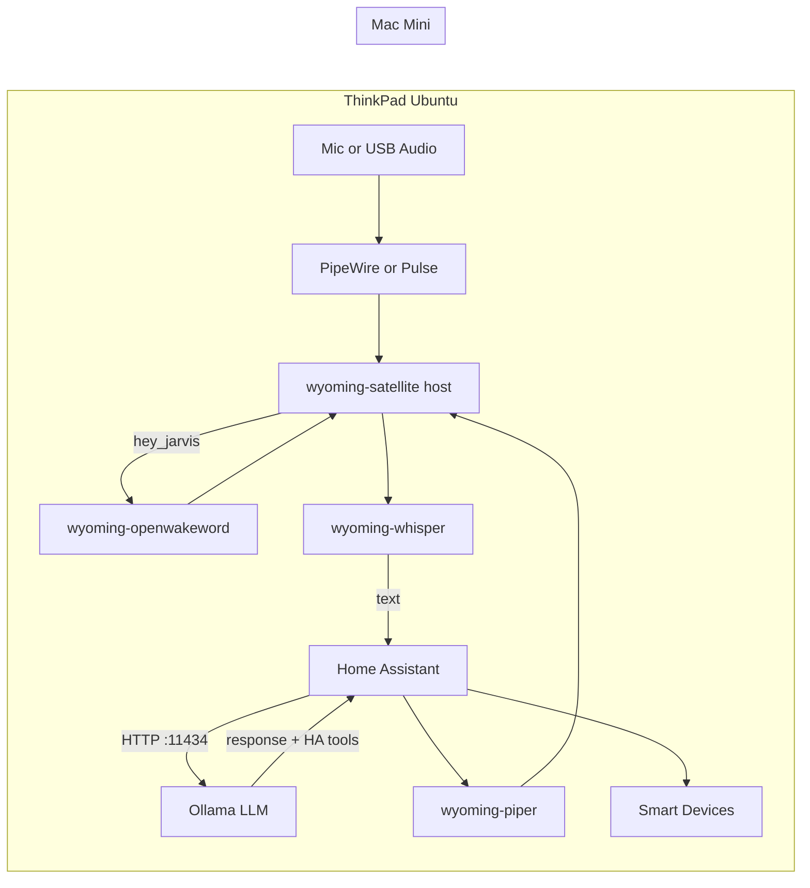

# Smart Home Assistant (Ubuntu)

Fully local smart home voice assistant running on Ubuntu (ThinkPad). Home Assistant orchestrates smart devices; Wyoming services handle wake word, speech-to-text, and text-to-speech on the ThinkPad; a Mac Mini runs Ollama for natural-language understanding and device control.

## Architecture



**Voice flow**

1. `wyoming-satellite`（ThinkPad 本体の systemd サービス）がマイク入力を待ち受ける。
2. `wyoming-openwakeword`（Docker）がウェイクワード `hey_jarvis` を検出する。
3. `wyoming-whisper` transcribes speech (Japanese/English auto-detection).
4. Home Assistant Assist sends the text to Ollama on the Mac Mini.
5. Ollama (with **Control Home Assistant** enabled) operates exposed entities.
6. `wyoming-piper` speaks the response in Japanese.

## Prerequisites

### ThinkPad (Ubuntu)

- Ubuntu with Docker and Docker Compose
- Built-in or USB microphone and speakers
- PipeWire/PulseAudio（Ubuntu デスクトップでは通常プリインストール）
- `alsa-utils` for audio device detection: `sudo apt install alsa-utils`
- LAN access to the Mac Mini

### Mac Mini

- [Ollama](https://ollama.com/download) installed
- Ollama listening on the LAN (not only localhost):

  ```bash
  # macOS: set in ~/.zshrc or launchd, then restart Ollama
  export OLLAMA_HOST=0.0.0.0:11434
  ```

- A model pulled, e.g.:

  ```bash
  ollama pull qwen2.5:3b
  # or: ollama pull llama3.2
  ```

- Firewall allows TCP `11434` from the ThinkPad IP

Verify from the ThinkPad:

```bash
curl http://<mac-mini-ip>:11434/api/tags
```

## Quick start

Clone this repository to `~/smarthome` on the ThinkPad:

```bash
git clone git@github.com:seiya0022/smart-home-assistant.git ~/smarthome
cd ~/smarthome
```

Run first-time setup:

```bash
./scripts/setup.sh
```

Install the voice satellite on the ThinkPad host (one-time):

```bash
./scripts/install-wyoming-satellite.sh
```

Edit `.env` with your Mac Mini IP and audio devices:

```bash
./scripts/detect-audio.sh   # confirm MIC_DEVICE / SND_DEVICE (default: pulse)
nano .env
./scripts/restart-wyoming-satellite.sh   # apply .env audio changes
docker compose up -d        # start Docker services
```

Open Home Assistant: `http://<thinkpad-ip>:8123`

Complete the [Home Assistant UI configuration](#home-assistant-ui-configuration) below.

## Directory layout

```
~/smarthome/
├── docker-compose.yml
├── .env.example
├── scripts/
│   ├── setup.sh
│   ├── install-wyoming-satellite.sh
│   ├── restart-wyoming-satellite.sh
│   ├── wyoming-satellite-logs.sh
│   └── detect-audio.sh
├── homeassistant/
│   └── config/
│       ├── configuration.yaml
│       ├── automations.yaml
│       ├── scripts.yaml
│       └── secrets.yaml.example
├── whisper/          # Whisper model cache (auto-downloaded)
└── piper/            # Piper voice model cache (auto-downloaded)
```

`wyoming-satellite` 本体は `~/wyoming-satellite` に clone され、user systemd サービスとして常駐します。

## Docker services

| Service | Port | Role | Runtime |
|---------|------|------|---------|
| `homeassistant` | 8123 (host) | Smart home hub, Assist pipeline | Docker |
| `wyoming-whisper` | 10300 | Speech-to-text | Docker |
| `wyoming-piper` | 10200 | Text-to-speech (Japanese) | Docker |
| `wyoming-openwakeword` | 10400 | Wake word (`hey_jarvis`) | Docker |
| `wyoming-satellite` | 10700 | Microphone input / speaker output | **Host (systemd)** |

Home Assistant uses `network_mode: host` to reach smart devices on the LAN. Wyoming services publish ports on `127.0.0.1` for HA to connect.

> **Note:** `wyoming-satellite` runs on the ThinkPad host (not Docker) for stable USB audio hot-plug via PipeWire/Pulse `pulse` device. The upstream [rhasspy/wyoming-satellite](https://github.com/rhasspy/wyoming-satellite) project is deprecated; [Linux Voice Assistant](https://github.com/OHF-Voice/linux-voice-assistant) is the successor. This host install keeps the current Wyoming stack working. You can migrate to ESP32-S3 or LVA later without changing the rest of the stack.

## Home Assistant UI configuration

After the first boot, configure integrations in the HA web UI.

### 1. Wyoming Protocol (×4)

Go to **Settings → Devices & services → Add integration → Wyoming Protocol**.

If services are not auto-discovered, add manually:

| Service | Host | Port |
|---------|------|------|
| Whisper | `127.0.0.1` | `10300` |
| Piper | `127.0.0.1` | `10200` |
| OpenWakeWord | `127.0.0.1` | `10400` |
| Satellite (ThinkPad) | `127.0.0.1` | `10700` |

### 2. Ollama

**Settings → Devices & services → Add integration → Ollama**

- **URL:** `http://<mac-mini-ip>:11434`
- **Model:** e.g. `qwen2.5:3b` (must match a model pulled on the Mac Mini)
- **Control Home Assistant:** enable this option

Expose entities the assistant may control:

**Settings → Voice assistants → Expose → Add entities**

Select lights, switches, climate, etc. Start with a small set and expand as needed.

### 3. Voice assistant

**Settings → Voice assistants → Add assistant**

| Setting | Value |
|---------|-------|
| Wake word | `hey_jarvis` (OpenWakeWord) |
| Speech-to-text | Whisper |
| Conversation agent | Ollama (with Control HA enabled) |
| Text-to-speech | Piper (`ja_JP-htm-medium`) |

Link the assistant to the ThinkPad satellite if prompted.

### 4. Test

Say **"hey_jarvis"**, wait for the listening tone, then speak a command in Japanese or English, e.g.:

- "リビングのライトをつけて"
- "Turn on the living room light"

The assistant should execute the action and respond via Piper TTS.

## Environment variables

Copy `.env.example` to `.env`:

| Variable | Description |
|----------|-------------|
| `TZ` | Timezone (default `Asia/Tokyo`) |
| `MIC_DEVICE` | ALSA device for microphone (`pulse` recommended; or `default`, `plughw:...`) |
| `SND_DEVICE` | ALSA device for speaker output (`pulse` recommended) |
| `MAC_MINI_IP` | Reference IP for Ollama (configured in HA UI) |
| `OLLAMA_MODEL` | Reference model name (configured in HA UI) |

## Troubleshooting

### Wyoming services not discovered

```bash
docker compose ps
docker compose logs wyoming-whisper
docker compose logs wyoming-piper
docker compose logs wyoming-openwakeword
./scripts/wyoming-satellite-logs.sh
```

Ensure ports `10200`, `10300`, `10400`, `10700` are listening:

```bash
ss -tlnp | grep -E '10200|10300|10400|10700'
```

Add integrations manually with `127.0.0.1` and the port above.

### Wake word or microphone not working

1. Run `./scripts/detect-audio.sh` and set `MIC_DEVICE` / `SND_DEVICE` in `.env` (default: `pulse`).
2. Confirm the user is in the `audio` group: `groups` (add with `sudo usermod -aG audio $USER` if needed).
3. Restart the satellite: `./scripts/restart-wyoming-satellite.sh`.
4. Check logs: `./scripts/wyoming-satellite-logs.sh`.

Test capture on the host:

```bash
arecord -D pulse -d 3 -f S16_LE -r 16000 test.wav
aplay test.wav
```

Replace `pulse` with your `MIC_DEVICE` value if you use a fixed ALSA device.

### USB microphone or speaker hot-plug

`MIC_DEVICE=pulse` and `SND_DEVICE=pulse` route audio through PipeWire/Pulse and follow the OS default input/output.

1. Plug in or unplug USB audio.
2. Open **Settings → Sound** and set the default input/output device.
3. Test with `arecord -D pulse -d 2 -f S16_LE -r 16000 test.wav`.
4. If wake word or playback still fails, run `./scripts/restart-wyoming-satellite.sh`.

For fixed hardware access (less hot-plug friendly), use `plughw:CARD=...,DEV=0` from `./scripts/detect-audio.sh`.

### Ollama connection failed

From the ThinkPad:

```bash
curl http://<mac-mini-ip>:11434/api/tags
```

If this fails:

- Confirm `OLLAMA_HOST=0.0.0.0:11434` on the Mac Mini and restart Ollama.
- Check Mac firewall settings.
- Use the Mac Mini LAN IP, not `localhost`, in the HA Ollama integration.

### LLM does not control devices

- Enable **Control Home Assistant** when adding the Ollama integration.
- Expose entities under **Settings → Voice assistants → Expose**.
- Use a model that supports tool/function calling (`qwen2.5:3b`, `llama3.2`, etc.).
- Device control via Ollama is experimental in Home Assistant; keep commands simple at first.

### Voice works in chat, but microphone times out (Ollama says: "pending request cancelled or timed out")

If you see this in the **Mac Mini Ollama server logs**:

- `pending request cancelled or timed out, skipping scheduling`

it means the **client disconnected before Ollama finished**. In this setup, the client is typically Home Assistant's voice pipeline (Assist). Chat can succeed while voice fails because voice has tighter end-to-end timing constraints (STT + LLM + TTS).

Fixes that usually help:

- **Use a smaller model for voice**: prefer `qwen2.5:3b` or `llama3.2:3b` instead of `qwen2.5:7b`.
- **Reduce context and history** for the voice conversation agent (e.g. `num_ctx <= 2048`, `max_history` `0-1` for voice).
- **Expose fewer entities** (start with a handful) if **Control Home Assistant** is enabled, because it increases prompt size.
- **Enable Prefer local intents** in the Voice Assistant pipeline so simple commands are handled locally without the LLM.
- **Increase wake refractory** on `wyoming-satellite` (`--wake-refractory-seconds 8`, set in the host systemd service) to reduce back-to-back wake detections that overlap Assist pipelines.
- **Run Docker in daemon mode** (`docker compose up -d`); the host satellite runs as a user systemd service and restarts automatically.

Measure Ollama latency from the ThinkPad (same path Home Assistant uses over LAN):

```bash
./scripts/benchmark-ollama.sh
```

Target: single-turn `elapsed_sec` under **2 seconds** with the model already warm on the Mac Mini (`ollama run qwen2.5:3b` or `keep_alive: -1` in HA).

Voice verification checklist (after changes):

1. ThinkPad benchmark under 2s; no `pending request cancelled` on the Mac Mini.
2. `docker compose up -d` and confirm the host satellite is running: `systemctl --user status wyoming-satellite`.
3. Say `hey_jarvis`, ask a short question, wait for TTS to finish.
4. Ask a second short question; confirm you hear a reply both times.
5. In logs: HA shows `conversation result`; satellite shows `synthesize`; no `Connection reset by peer`.

### STT language / TTS voice

- Whisper uses `--language auto` for Japanese and English detection.
- Piper is configured for Japanese only (`ja_JP-htm-medium`). English replies are spoken with the Japanese voice. To add English TTS later, run a second Piper container on another port with an English voice and a second Assist pipeline.

## Operations

```bash
# Start Docker services
docker compose up -d

# Stop Docker services (host satellite keeps running)
docker compose down

# View Docker logs
docker compose logs -f

# Host satellite status / logs / restart
systemctl --user status wyoming-satellite
./scripts/wyoming-satellite-logs.sh
./scripts/restart-wyoming-satellite.sh

# Restart after Docker config change
docker compose up -d --force-recreate
```

Daily startup: `docker compose up -d` only. The host `wyoming-satellite` service starts automatically at login (or boot if `loginctl enable-linger` is enabled during install).

### Migrate from Docker satellite

If you previously ran `wyoming-satellite` in Docker:

```bash
docker compose stop wyoming-satellite
docker compose rm -f wyoming-satellite
docker compose up -d
# Set MIC_DEVICE=pulse and SND_DEVICE=pulse in .env
./scripts/install-wyoming-satellite.sh
ss -tlnp | grep 10700
```

Then test wake word and TTS. USB hot-plug: switch defaults in **Settings → Sound**; restart with `./scripts/restart-wyoming-satellite.sh` if needed.

Back up `homeassistant/config/` regularly (excluding `.storage` is optional; including it preserves UI integration config).

### 24/7 Operation (Ubuntu Laptop)

Configure Ubuntu to keep running when the laptop lid is closed.

#### 🔴 【24/7 ON】 Keep running when lid is closed (Ignore lid switch)

**Step 1:** Open the configuration file

```bash
sudo nano /etc/systemd/logind.conf
```

**Step 2:** Find the line under `[Login]` and change it (remove the leading `#`).

- Before: `#HandleLidSwitch=suspend`
          `#HandleLidSwhitchExternalPower=suspend`
- After: **`HandleLidSwitch=ignore`**
         **`HandleLidSwhitchExternalPower=ignore`**

**Step 3:** Save and close (`Ctrl + O` ➔ `Enter` ➔ `Ctrl + X`)

**Step 4:** Apply the changes to the system

```bash
sudo systemctl restart systemd-logind
```

#### 🟢 【Revert】 Sleep when lid is closed (Default)

**Step 1:** Open the configuration file

```bash
sudo nano /etc/systemd/logind.conf
```

**Step 2:** Revert the line back to default (add `#` and change to `suspend`).

- Before: `HandleLidSwitch=ignore`
- After: **`#HandleLidSwitch=suspend`**

**Step 3:** Save and close (`Ctrl + O` ➔ `Enter` ➔ `Ctrl + X`)

**Step 4:** Apply the changes to the system

```bash
sudo systemctl restart systemd-logind
```

## Future extensions

- **ESPHome voice satellite** or **Linux Voice Assistant:** replace host `wyoming-satellite` with dedicated hardware or the LVA successor stack.
- **Second Piper instance:** English TTS for bilingual responses.
- **Custom bridge API:** if HA Ollama integration is insufficient, add a small Python service between STT and device actions.

## License

See repository license. Third-party images: [Home Assistant](https://www.home-assistant.io/), [Rhasspy Wyoming](https://github.com/rhasspy/wyoming), [Ollama](https://ollama.com/).
